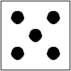

## Dé aléatoire



### Prérequis
- structures de contrôle ;
- fonctions ;
- boucles ;
- modules ;

### Présentation
  
L'objectif de ce projet est de créer un programme qui affiche aléatoirement la face d'un dé cubique. Pour les plus rapides vous pourrez laisser le choix d’afficher plusieurs dés en même temps.

Vous apporterez un soin particulier à votre code en respectant les règles de bonne conduite suivantes :

Un programme
- doit être lisible et clair ;
- doit être découpé en petits composants faisant peu de choses, mais les faisant bien ;
- ne doit pas avoir du code répété ;
- doit séparer calculs et interface homme/machine ;
- doit être documenté ;
- doit être testé.

Ce projet est individuel et sera noté. Pour avoir les détails concernant la notation consultez la page sur [l'évaluation des projets](../projets.mdx).

Pour faire ce projet, vous aurez besoin du module ```turtle``` et du module ```random```. Nous avons déjà utilisé le module random dans le cours. Le module turtle permet de faire des dessins simples assez facilement. Voici la [documentation officielle du module turtle](https://docs.python.org/fr/3/library/turtle.html) ainsi qu'un [mémo sur le module turtle](../turtle) pour découvrir le module.

Pour commencer, vous pouvez créer une fonction ```cercle(x, y, r)``` qui tace un cercle de centre (x, y) et de rayon r. Attention ! turtle a une façon très particulière de tracer les cercles.

### Tableau du barème

| Tâche	| Barème |
|  :-:  |  :--:  |
| Tracé d'un carré | 1 point |
| Tracé d'un cercle | 1 point |
| Tracé d'une face | 1 point |
| Tracé des 6 faces | 2 points |
| Tirage aléatoire de la face | 1 point |
| Affichage aléatoire de la face du dé | 1 point |
| Utilisation d'une fonction pour les cercles | 2 points |
| Optimisation de l'affichage des faces | 2 points |
| Affichage d'au moins deux dés | 3 points |
| commentaires | 2 points |
| code propre | 2 point |
| code optimisé | 2 points |
| Totals | 20 |
