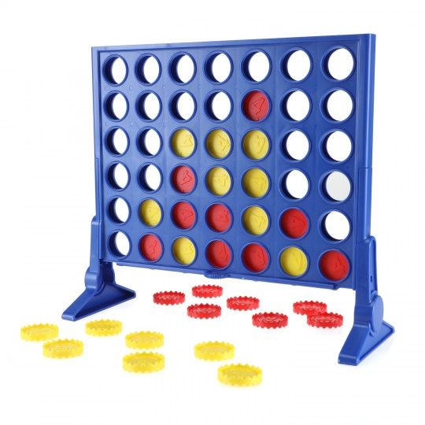

## Puissance 4



### Prérequis
- structures de contrôle ;
- fonctions ;
- boucles ;
- tableaux à deux dimensions ;

### Introduction
Nous allons programmer un jeu de puissance 4 en ligne de commande. Les plus rapides et motivés pourront éventuellement s'amuser à créer une interface graphique.

Le jeu de puissance 4 se joue à deux joueurs avec une grille de 7 colonnes et 6 rangées. Un joueur possède des jetons rouges et l'autre des jetons jaunes. Les joueurs mettent chacun leur tour un jeton dans une colonne. Le but est d'être le premier à aligner 4 jetons verticalement, horizontalement ou en diagonale. Si personne n'arrive à aligner 4 jetons avant que la grille ne soit remplie il y a match nul.

### Travail à effectuer
C'est un projet complexe que l'on peut décomposer en différentes étapes correspondant à des fonctions Python réalisant chacune une action. Nous allons détailler ces étapes ici. La grille du jeu sera représenté par un tableau à deux dimensions. Les 0 correspondent à des cases vides, les 1 aux jetons du joueur 1 et les 2 aux jetons du joueur 2.

- grille_init() : fontion qui renvoie un tableau de 6 lignes et 7 colonnes remplies de zéros ;
- affiche_grille(tab) : fonction qui affiche la grille du jeu dans la console de la façon la plus esthétique possible (voir la suggestion ci-dessous à améliorer) ;

```
+---+---+---+---+---+---+---+
| 0 | 0 | 0 | 0 | 0 | 0 | 0 |
+---+---+---+---+---+---+---+
| 0 | 0 | 0 | 0 | 0 | 0 | 0 |
+---+---+---+---+---+---+---+
| 0 | 0 | 0 | 0 | 0 | 0 | 0 |
+---+---+---+---+---+---+---+
| 0 | 0 | 0 | 0 | 0 | 0 | 0 |
+---+---+---+---+---+---+---+
| 0 | 0 | 2 | 1 | 0 | 0 | 0 |
+---+---+---+---+---+---+---+
| 0 | 0 | 1 | 2 | 0 | 0 | 0 |
+---+---+---+---+---+---+---+
```

- colonne_libre(tab, colonne) : fonction qui renvoie un booléen indiquant s'il est possible de mettre un jeton dans la colonne (indique si la colonne n'est pas pleine) ;
- place_jeton(tab, colonne, joueur) : fonction qui place un jeton du joueur (1 ou 2) dans la colonne. Elle renvoie la grille modifiée ;
- horizontale(tab, joueur) : fonction qui renvoie True si le joueur a au moins 4 jetons alignés dans une ligne ;
- verticale(tab, joueur) : fonction qui renvoie True si le joueur a au moins 4 jetons alignés dans une colonne ;
- diagonale(tab, joueur) : fonction qui renvoie True si le joueur a au moins 4 jetons alignés dans une diagonale ;
- gagne(tab, joueur) : fonction qui renvoie True si le joueur a gagné ;
- tour_joueur(tab, joueur) : fonction qui permet au joueur de placer un jeton dans la colonne choisie. Elle indique si la colonne est pleine et permet alors au joueur de choisir une autre colonne ;
- egalite(tab) : fonction qui renvoie True s'il y a égalité et False sinon ;
- jouer(tab) : fonction qui permet aux deux joueurs de jouer chacun leur tour. Elle vérifie que les joueurs n'ont pas gagné à la fin de leur tour. Si l'un des deux à gagné ou s'il y a égalité, elle donne le résultat ;

### Tableau du barème
Voilà le barème complet sur 20 pour ce projet.

| Tâche	| Barème |
|  :-:  |  :--:  |
| grille_init	| 1 point |
| affiche_grille	| 2 points |
| colonne_libre	| 1 points |
| place_jeton	| 2 points |
| horizontale	| 2 points |
| verticale	| 1 point |
| diagonale	| 3 points |
| gagne	| 1 point |
| tour_joueur	| 1 point |
| egalite	| 1 point |
| jouer	| 1 point |
| code optimisé	| 1.5 point |
| commentaires	| 1 point |
| code propre	| 1.5 point |
| Interface de jeu améliorée	| 1 point bonus |
| Total	| 20 |
