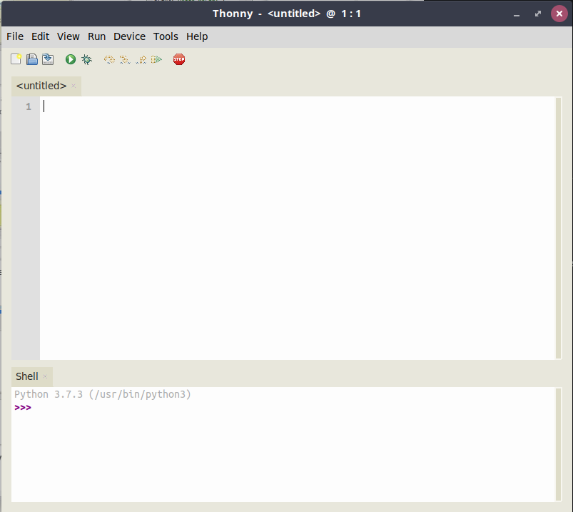

## Bases de Python

Pour rendre la programation plus simple et rapide, on utilise généralement un
IDE (environnement de développement). Un environnement de développement est un
logiciel qui facilite l’écriture d’un programme. Il en existe des dizaines
pour Python, certains sont très complets et d'autres plus simples. Vous
disposez au lycée de Spyder, IDLE et Thonny. Je vous conseillerais d’utiliser
Thonny pour ça simplicité.

 Licence MIT

Lancez donc Thonny pour commencer à écrire des instructions Python.

 Auteur : Thomas Beline | [Attribution - Partage dans les Mêmes Conditions 4.0 International](https://creativecommons.org/licenses/by-sa/4.0/deed.fr)

Dans un premier temps, nous allons seulement écrire dans le « shell » en bas
de la fenêtre.
